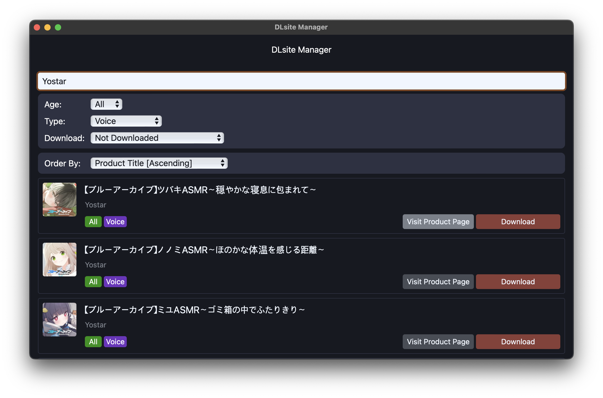
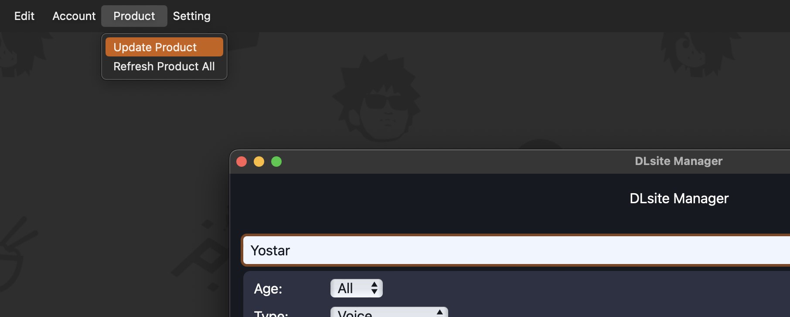
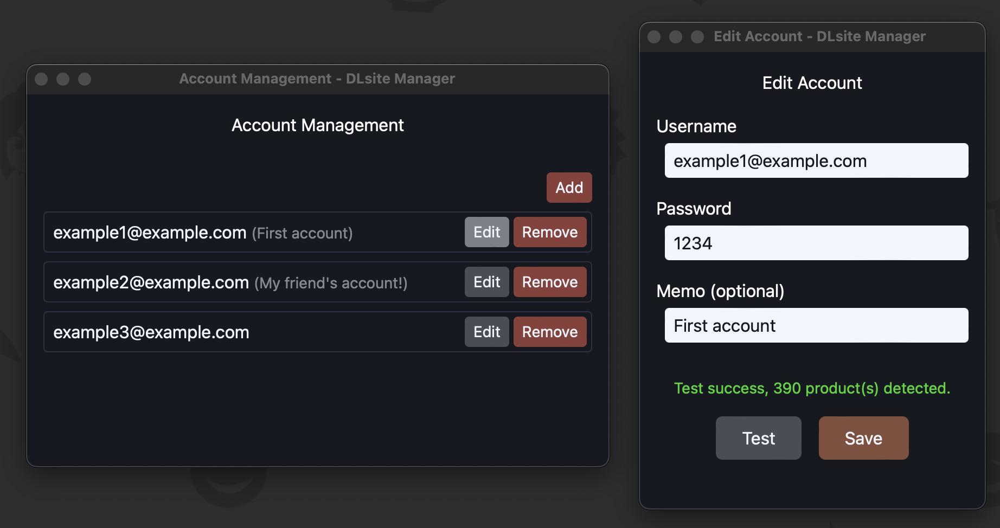

# dlsite-manager

Easies way to enjoy the DLsite!

## Key Features

- List, search and download your products.
- Manage multiple accounts at once.

## Product download

To start download, just press the `Download` button. You don't need to decompress or run extractors. The `dlsite-manager` will handle other tedious jobs for you!

> **NOTE**: Download path can be configured via `Setting > Open Settings` menu.

### Platform-specific behavior of automatic extraction

Large-sized products (over 1GiB) are shipped in [SFX(Self-extracting archive)](https://en.wikipedia.org/wiki/Self-extracting_archive) format. Since it's a [PE executable](https://en.wikipedia.org/wiki/Portable_Executable), decompression of this format is only can be happened in **_Windows_**.

## Renew product list

The products are cached on your machine, so newly purchased things will not be shown. To refresh it, click the menu `Product > Update Product`.

> **NOTE**: If you want to drop caches and update products entirely, click the menu `Product > Refresh Product All` instead.

## Account management

Do you have multiple accounts? Don't worry! The `dlsite-manager` will manage them, so you don't need to care. _Also, never forget to test your account!_

