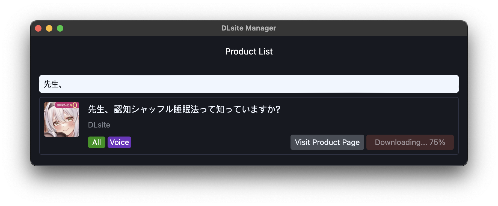
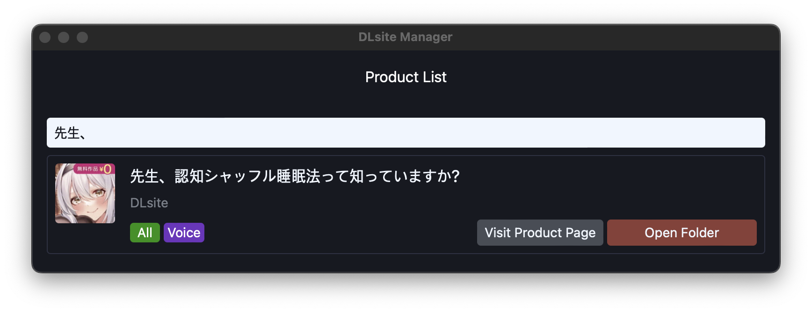

# dlsite-manager

This application manages your DLsite products.

## Key Features

- Manage multiple accounts at once.
- List, search and download your products.

## Account management

You can register many accounts as you want. Products from each account are merged before being listed.

Don't forget to test your account!

## Product download

You can download products by simply clicking the `Download` button. It will show you the progress. The downloading path can be configured via `Setting > Open Settings` menu.

After it's done, you can open the saved directory.

The saved products are automatically decompressed and cleaned-up if applicable.

### Platform-specific behavior of automatic extraction

Large-sized products (over 1GiB) are shipped in [SFX(Self-extracting archive)](https://en.wikipedia.org/wiki/Self-extracting_archive) format. Since it's a [PE executable](https://en.wikipedia.org/wiki/Portable_Executable), decompression of this format is only can be happened in Windows.
