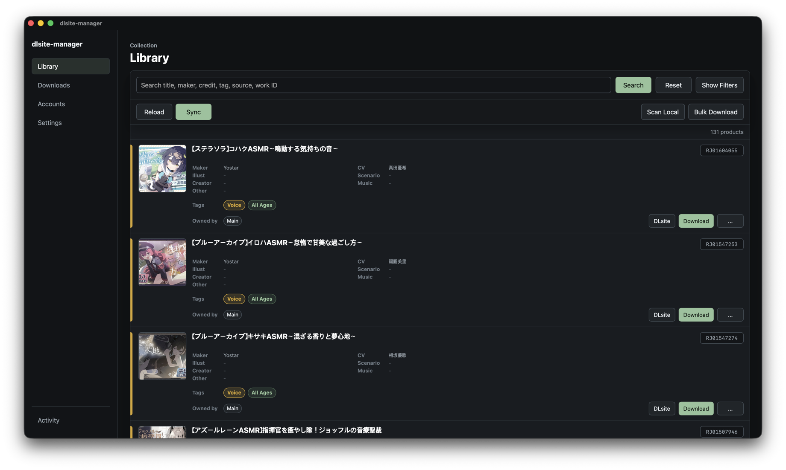
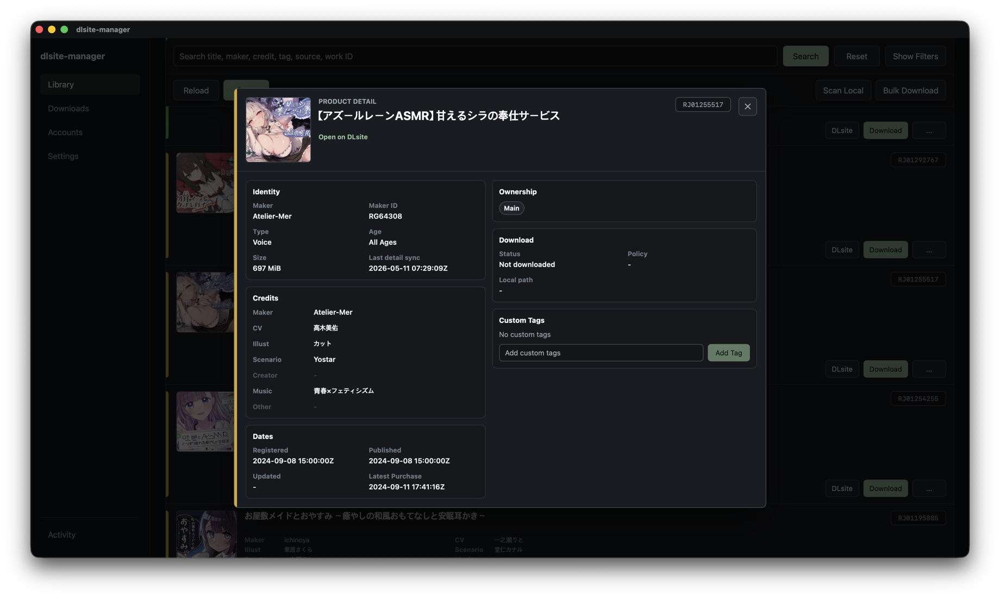
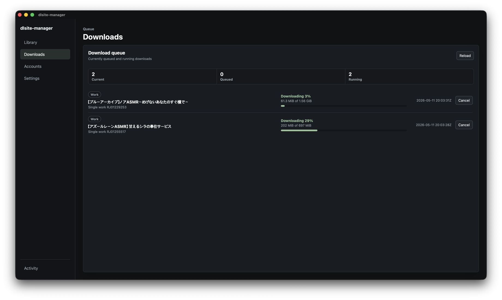
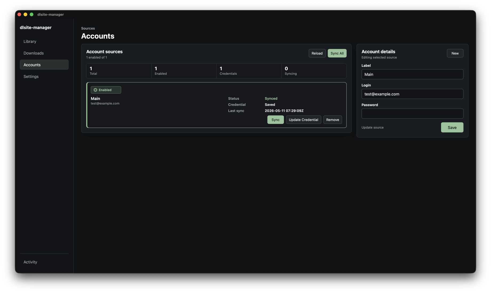
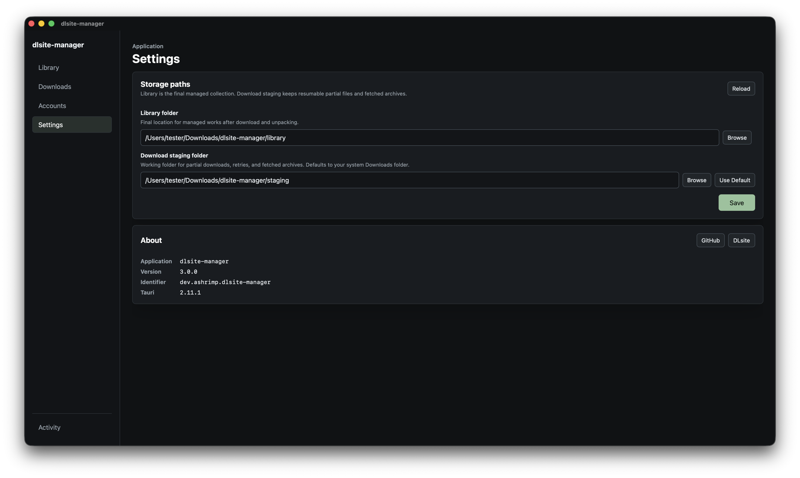
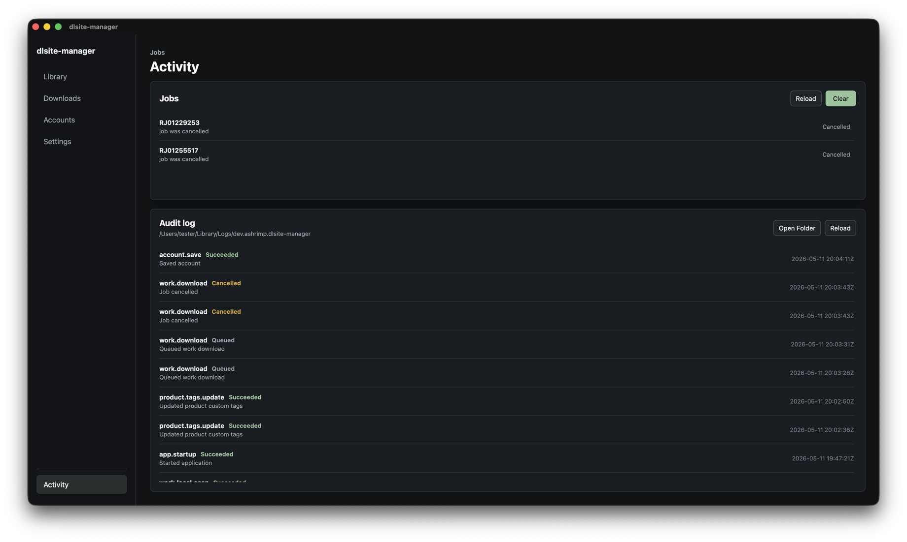

# dlsite-manager

A desktop library manager for DLsite works.

`dlsite-manager` helps you keep a large DLsite collection searchable, downloaded, and organized. It syncs purchases from one or more DLsite accounts, merges them with local folders, tracks download state, and gives each work a consistent place for metadata, tags, ownership, local paths, and actions.

This is an unofficial project and is not affiliated with DLsite.

## What It Does

- Builds one unified library from DLsite purchases, multiple accounts, and local-only folders.
- Searches and filters by title, work ID, maker, credits, account source, local/not-owned source, age class, work type, and custom tags.
- Shows product details such as thumbnail, maker, credits, ownership, dates, local path, download state, and DLsite product link.
- Downloads archive-based works with progress, cancellation, resume, and a dedicated Downloads queue.
- Handles normal archives, serial-required products, and legacy split archives.
- Keeps downloaded works in a managed library folder and resumable partial files in a staging folder.
- Records app activity and detailed failures in file-backed audit logs for troubleshooting.

## Download

Get the latest build from the [GitHub releases page](https://github.com/AcrylicShrimp/dlsite-manager/releases/latest).

The current published binary is a macOS Apple Silicon DMG. Other platforms can be built from source until additional packaging is added.

## Main Workflows

### Library



The Library page is the main workspace. Use it to browse synced purchases and local-only works, search or filter the collection, open product details, copy useful fields, add custom tags, open DLsite product pages, download works, or open downloaded folders.

### Product Details



Open a work to inspect its metadata, ownership, download state, custom tags, local path, credits, dates, and DLsite product link without leaving the Library context.

### Downloads



The Downloads page shows currently queued and running downloads. Download jobs expose status, progress, cancellation, and current phase information such as resolving files, downloading, checking files, decompressing, and finalizing.

### Accounts



Add one or more DLsite accounts and sync them into the same unified library. Products owned by multiple accounts are shown once with account ownership preserved.

### Local Library

Existing folders can be scanned into the library as local-only / not-owned works. This lets the app manage downloaded or imported works even when they were not synced from the configured accounts.

### Settings



Choose where managed works are stored, where resumable downloads are staged, and confirm app/version information when reporting problems.

### Activity



The Activity page shows recent jobs and audit log entries. Audit logs are written to the app log directory so support reports can include concrete operation history without relying only on screenshots or memory.

## Getting Started

1. Open **Accounts** and add a DLsite account.
2. Run **Sync** to cache purchased works.
3. Use **Library** to search, filter, tag, inspect, download, or open works.
4. Use **Downloads** to watch active downloads and cancel running jobs.
5. Use **Settings** to choose the final library folder and download staging folder.
6. Use **Activity** when you need recent job history or audit logs for troubleshooting.

## Storage And Credentials

The app stores library metadata in SQLite under the application data directory. Downloaded works are stored in the configured library folder, while partial downloads and fetched archives use the configured staging folder so interrupted downloads can resume.

Saved account credentials are kept in the app credential store, separate from the SQLite database. Do not share passwords, cookies, or serial numbers in bug reports.

Audit logs are written to the app log directory. When reporting a bug, include the app version, affected work ID, steps to reproduce, and relevant audit log entries.

## Current Scope

Download support currently targets archive downloads:

- normal single-archive products
- serial-required products
- legacy split archives
- downloaded folder opening and deletion
- re-download with confirmation
- local folder import / manual downloaded-state marking

Browser-reader-only workflows, including manga download behavior, still need separate research.

## Development

Prerequisites:

- Rust stable
- Node.js and pnpm
- Tauri 2 system prerequisites for your platform

Common commands:

```sh
pnpm install
pnpm check
cargo test --workspace
pnpm tauri dev
pnpm tauri build
```

Live DLsite API/download tests are env-gated. Use the `.env.example` files in the relevant crates when validating those surfaces:

- `crates/dm-api/.env.example`
- `crates/dm-download/.env.example`
- `crates/dm-archive/.env.example`

## Architecture

The app keeps DLsite/domain behavior in reusable Rust crates and leaves the Tauri layer as a thin adapter. The current implementation targets DLsite Play v3 APIs.

- `crates/dm-api` - DLsite Play v3 API, authentication, metadata, download-plan discovery, authenticated byte streams
- `crates/dm-download` - resumable file downloads and progress reporting
- `crates/dm-archive` - archive classification and extraction
- `crates/dm-storage` - SQLite persistence and SQLx migrations
- `crates/dm-library` - application services that combine API, storage, credentials, downloads, and local-library behavior
- `crates/dm-jobs` - background job snapshots, progress, and cancellation
- `crates/dm-audit` - file-backed audit log records
- `crates/dm-credentials` - app credential storage
- `src-tauri` - Tauri commands, events, and desktop integration
- `src/routes` - Svelte UI

## License

MIT
